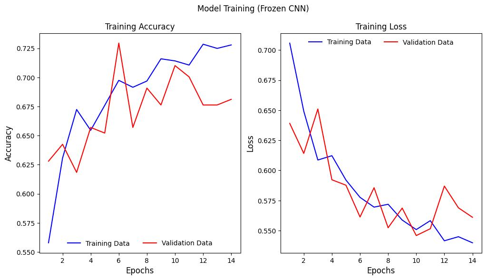

# Brain Tumor Detection using VGG19

Implements a Convolutional Neural Network (CNN) based on the **VGG19** architecture to detect brain tumors from MRI scans. It utilizes Transfer Learning by leveraging pre-trained ImageNet weights to classify images into two categories: `Tumorous` (Yes) and `Non-Tumorous` (No).

### Performance Analysis
The training graphs illustrate a model that is successfully learning patterns but hitting a performance "ceiling" due to the frozen VGG19 base.

#### 1. Accuracy (Left Graph)
* **The Blue Line (Training):** Climbs steadily from **56% to 73%**. This indicates the custom dense layers are successfully learning to classify the training images.
* **The Red Line (Validation):** Shows high volatility. It peaks early at **72% (Epoch 6)** but fluctuates significantly and eventually drops to **~68%**.
* **Interpretation:** The widening gap between the blue and red lines indicates **Overfitting**. The model is beginning to "memorize" the training data specificities rather than generalizing well to new, unseen MRI scans.

#### 2. Loss (Right Graph)
* **EarlyStopping ("The Quitter"):** functioned correctly.
* While the **Training Loss** continued to decrease, the **Validation Loss** hit its lowest point at Epoch 10 and began to rise.
* The system automatically halted training at **Epoch 14** to prevent further degradation of the model.

> **Note on Hardware:** The high resource consumption observed during this phase (High CPU/RAM usage) validates the decision to migrate training to the Linux server with dedicated GPU resources for subsequent Fine-Tuning.
165

---

## 📂 Dataset & Preprocessing

### 1. Dataset Structure
The dataset consists of MRI images separated into two classes:
* **Yes:** MRI scans containing a tumor.
* **No:** Healthy MRI scans.

### 2. Preprocessing
To improve model robustness and handle data imbalance, several preprocessing steps were applied:
* **Renaming:** Files were standardized to `Y_[index].jpg` and `N_[index].jpg`.
* **Cropping:** A custom contour detection algorithm (using OpenCV) was used to crop the black background, focusing solely on the brain region.
* **Data Augmentation (Training Only):** To solve class imbalance (fewer 'No' images) and prevent overfitting, the training data was augmented with:
    * Rotation (40°)
    * Width/Height Shifts (0.4)
    * Shear & Zoom (0.2)
    * Horizontal & Vertical Flips
* **Validation/Test Data:** Kept raw (only rescaled) to ensure fair evaluation.

### 3. Data Split
The data was split into three sets:
* **Train:** 70% (Augmented)
* **Validation:** 15% (Raw)
* **Test:** 15% (Raw)

**Generator Configuration:**
* **Batch Size:** 32
* **Input Size:** 224 x 224 (Standard for VGG19)

## 🧠 Model Architecture: VGG19

I utilized **Transfer Learning** with the VGG19 architecture.

### 1. The Base (The "Eyes")
* **Model:** VGG19 (19 layers deep).
* **Weights:** Pre-trained on **ImageNet** (loaded from local file).
* **Status:** **Frozen**. The convolutional base was set to `trainable=False` to preserve the feature extraction capabilities learned from millions of images.
* **Non-Trainable Parameters:** ~20 Million.

### 2. The Custom Head (The "Brain")
I added a custom fully connected neural network for classification:
* **Flatten Layer:** Converts the 2D feature maps from VGG into a 1D vector (25,088 values).
* **Dense Layer 1:** 4,608 neurons with `ReLU` activation.
    * *Note: This massive layer creates 115 Million parameters, consuming ~3.5GB of RAM.*
* **Dropout Layer:** 0.2 (20%) drop rate to prevent overfitting by randomly disabling neurons during training.
* **Dense Layer 2:** 1,152 neurons with `ReLU` activation (funneling information).
* **Output Layer:** 2 neurons with `Softmax` activation (probabilities for Yes/No).

### 3. Compilation
* **Optimizer:** SGD (Stochastic Gradient Descent)
    * Learning Rate: 0.0001 (Small steps for stability)
    * Momentum: 0.9 (To accelerate convergence)
    * Nesterov: True
* **Loss Function:** Categorical Crossentropy
* **Metrics:** Accuracy

### 4. Callbacks (The "Assistants")
* **EarlyStopping:** "The Quitter" - Stops training if `val_loss` doesn't improve for 4 epochs.
* **ModelCheckpoint:** "The Autosave" - Saves the best version of the model (lowest validation loss).
* **ReduceLROnPlateau:** "The Fine-Tuner" - Reduces learning rate by 50% if accuracy stalls for 3 epochs.

## 💻 Hardware & Performance

### Training Environment
* **Initial Setup:** Jupyter Kernel on CPU (High RAM usage observed).
* **Production Training:** Migrated to Linux Server.
* **GPU:** **NVIDIA Quadro RTX 8000**
    * *Settings:* `CUDA_VISIBLE_DEVICES=3` (Used specific GPU to optimize resource allocation).
    * *Utilization:* ~50-90% during training bursts.

### Model Complexity
| Layer (type) | Output Shape | Param # |
| :--- | :--- | :--- |
| **input_layer_1** (InputLayer) | (None, 224, 224, 3) | 0 |
| **block1...block5** (VGG19) | ... | ~20,024,384 (Frozen) |
| **flatten_1** (Flatten) | (None, 25088) | 0 |
| **dense_3** (Dense) | (None, 4608) | **115,610,112** |
| **dropout_1** (Dropout) | (None, 4608) | 0 |
| **dense_4** (Dense) | (None, 1152) | 5,309,568 |
| **dense_5** (Output) | (None, 2) | 2,306 |
| **Total Trainable Params** | | **~120,921,986** |

## Results (Phase 1: Frozen Base)
* **Training Accuracy:** ~72.8%
* **Validation Accuracy:** ~68.1%
* ** Next Step**: Fine-Tuning is necessary. By unfreezing the last few layers of VGG19 and retraining on the GPU server, it will allow the "eyes" of the model to adapt specifically to MRI scans, which should smooth out those red lines and push accuracy above 90%.